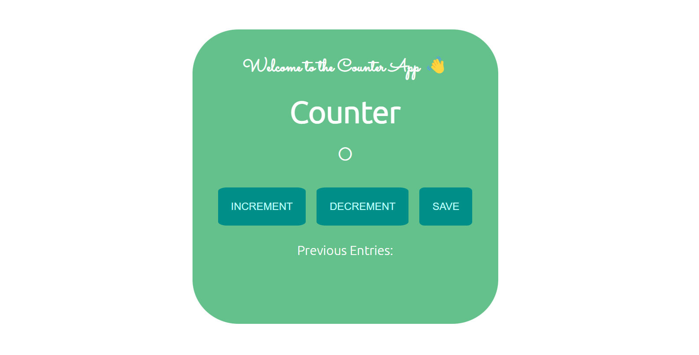
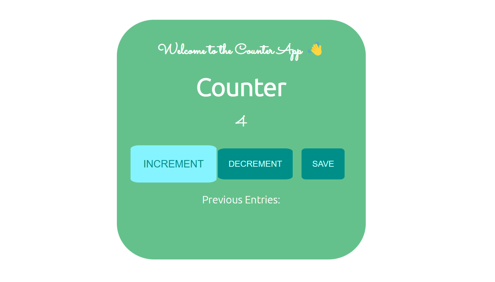
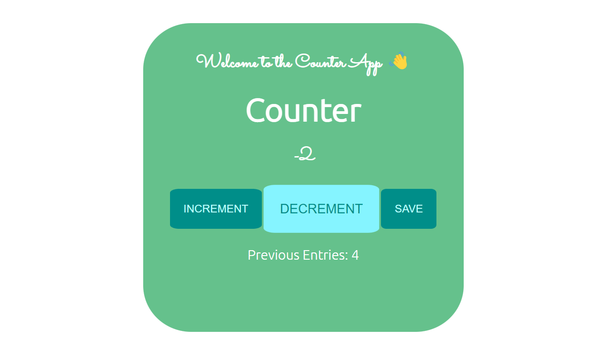
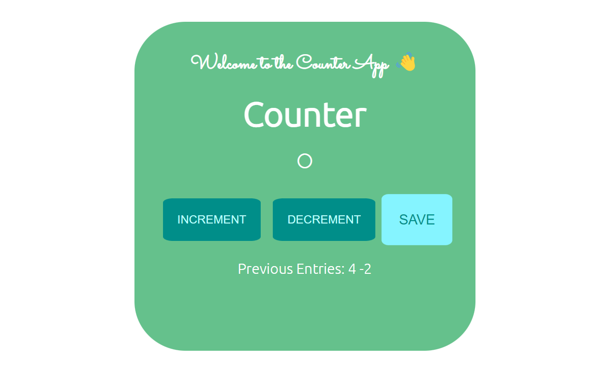

<h1 align="center">Counter</h1>
<h3 align="center">This is a simple counter website made using HTML5, CSS3 and Javascript.</h3>
<h3 align="center">This website have basic functionalities such as increment, decrement and save entries.</h3>
 
<h2>Screenshots: </h2>

